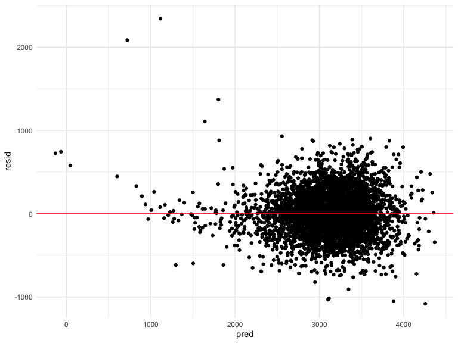
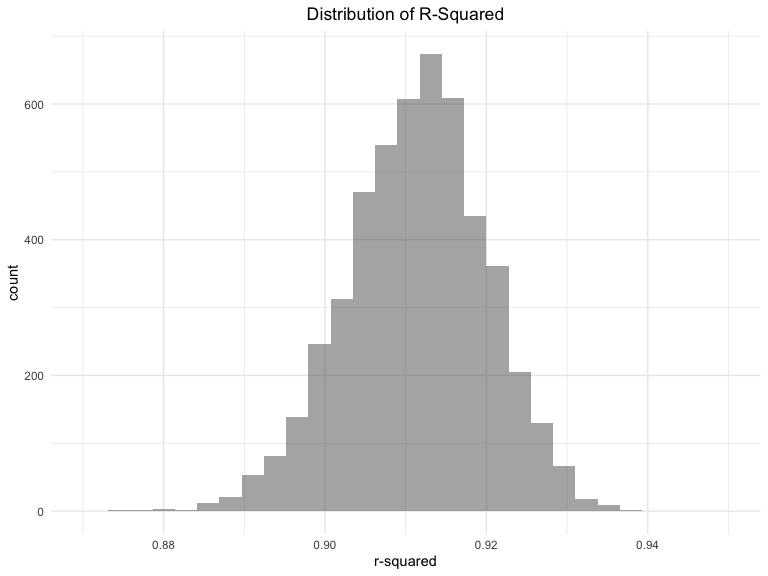
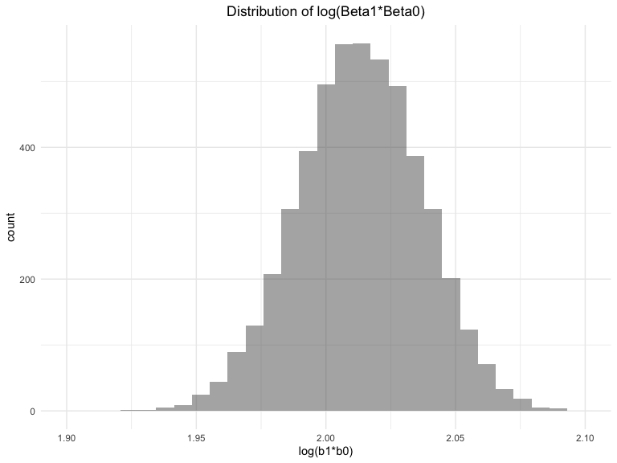

Homework 6
================
Rebecca Silva
11/15/2019

### Problem 1

``` r
# data read in 
birthweight = 
  read_csv("./data/birthweight.csv") %>% 
  mutate(babysex = factor(babysex, 
                          labels = c("male", "female")), 
         frace = factor(frace, 
                        labels = c("white", "black", "asian", "puerto rican", "other")),
         malform = factor(malform, 
                          labels = c("absent", "present")), 
         mrace = factor(mrace, 
                        labels = c("white", "black", "asian", "puerto rican")))

# 0 missing values
missing_vals = sum(is.na(birthweight))
```

Since we are starting off with 20 variables, we first eliminate some
based on general hypotheses about variables that might not explain
birthweight well and based on their respective correlation to
birthweight `wgt`, shown below.

``` r
# correalation matrix 
birthweight_numeric = 
  select_if(birthweight, is.numeric)
round(cor(birthweight_numeric %>% select(-bwt), birthweight %>% pull(bwt)), 2)
```

    ##           [,1]
    ## bhead     0.75
    ## blength   0.74
    ## delwt     0.29
    ## fincome   0.15
    ## gaweeks   0.41
    ## menarche -0.02
    ## mheight   0.19
    ## momage    0.14
    ## parity   -0.01
    ## pnumlbw     NA
    ## pnumsga     NA
    ## ppbmi     0.09
    ## ppwt      0.18
    ## smoken   -0.08
    ## wtgain    0.25

In order to predict birthweight, we want to understand how our given
variables relate to birthweight, and ultimately, include the most
important predictors of birthweight in our model. We will focus on the
variables, `bhead`, `blength`, `gaweeks`, `wtgain`, `delwt`, `mrace`,
`frace`, `babysex`, and `smoken`.

We include some graphical depictions of the relationships that seem to
have the strongest association. A linear relationship looks likely
between many of the variables and `birthweight`.

``` r
# baby’s head circumference at birth (centimeters)
birthweight %>% 
  ggplot(aes(x = bhead, y = bwt)) + 
  geom_point(alpha = .5)
```


``` r
# baby's gestational age
birthweight %>% 
  ggplot(aes(x = gaweeks, y = bwt)) + 
  geom_point(alpha = .5)
```


``` r
mod_full = lm(bwt ~ ., data = birthweight)

# adding all continuous w strong correlation
# and add all catergorical except malform
mod1 = 
  lm(bwt ~ bhead + blength + gaweeks + wtgain + delwt + mrace + frace + babysex  + smoken,
     data = birthweight)
# mod1 %>% broom::glance()
# mod1 %>% broom::tidy()


# add interactions for sex 
mod_sex = 
  lm(bwt~ (bhead + blength + gaweeks + wtgain + delwt + mrace + frace +  + smoken)*babysex,
     data = birthweight)

# keep significant interactions
mod_sex_sig = 
  lm(bwt~ bhead*babysex + blength + gaweeks + wtgain + delwt + smoken+ mrace + frace, 
     data = birthweight)
```

Although we fit a full model at first, we do not use p-values to take
out predictors and only use the full fit to compare R-squared measures.
After starting off with the predictors mentioned above, we add an
interaction term of sex with all the variables and see which ones are
significant. This is based on the hypothesis that the levels of sex may
effect certain predictor’s relationship to birthweight. Since we find
that only `bhead*babysex` is significant we keep only that interaction
term.

We next checked for multicoliniearity, and take out father’s race since
we already include mother race and the two predictors are highly
correlated.

``` r
# check for multicollinearity 
car::vif(mod_sex_sig)
```

    ##                     GVIF Df GVIF^(1/(2*Df))
    ## bhead           2.766772  1        1.663362
    ## babysex       445.778864  1       21.113476
    ## blength         1.758342  1        1.326025
    ## gaweeks         1.235812  1        1.111671
    ## wtgain          1.245522  1        1.116030
    ## delwt           1.300026  1        1.140187
    ## smoken          1.102735  1        1.050112
    ## mrace         476.789454  3        2.795038
    ## frace         474.326821  4        2.160278
    ## bhead:babysex 439.800223  1       20.971414

``` r
# take out father's race bc high correlation with mom race 
mod_reduced = lm(bwt~ bhead+ babysex + blength + gaweeks + wtgain + delwt + mrace + smoken, data = birthweight)
#car::vif(mod_reduced)
```

``` r
# partial f-tests
mod_small = 
  lm(bwt~ bhead*babysex + blength + gaweeks + wtgain + delwt + mrace  + smoken, 
     data = birthweight)

mod_full = lm(bwt ~ ., data = birthweight)

anova(mod_small, mod_full) 
```

    ## Analysis of Variance Table
    ## 
    ## Model 1: bwt ~ bhead * babysex + blength + gaweeks + wtgain + delwt + 
    ##     mrace + smoken
    ## Model 2: bwt ~ babysex + bhead + blength + delwt + fincome + frace + gaweeks + 
    ##     malform + menarche + mheight + momage + mrace + parity + 
    ##     pnumlbw + pnumsga + ppbmi + ppwt + smoken + wtgain
    ##   Res.Df       RSS Df Sum of Sq      F  Pr(>F)  
    ## 1   4330 322408241                              
    ## 2   4320 320724338 10   1683903 2.2681 0.01214 *
    ## ---
    ## Signif. codes:  0 '***' 0.001 '**' 0.01 '*' 0.05 '.' 0.1 ' ' 1

``` r
mod_final = 
  lm(bwt~ bhead*babysex + blength + gaweeks + wtgain + delwt + mrace  + smoken, data = birthweight)

mod_final %>% 
  broom::tidy() %>% 
  select(term, estimate, p.value) %>% 
  knitr::kable(digits = 3)
```

| term                |   estimate | p.value |
| :------------------ | ---------: | ------: |
| (Intercept)         | \-5901.219 |   0.000 |
| bhead               |    136.344 |   0.000 |
| babysexfemale       |    392.903 |   0.025 |
| blength             |     75.249 |   0.000 |
| gaweeks             |     11.305 |   0.000 |
| wtgain              |      2.414 |   0.000 |
| delwt               |      1.796 |   0.000 |
| mraceblack          |  \-147.951 |   0.000 |
| mraceasian          |   \-80.179 |   0.058 |
| mracepuerto rican   |  \-121.708 |   0.000 |
| smoken              |    \-4.811 |   0.000 |
| bhead:babysexfemale |   \-10.793 |   0.038 |

Even though a Nested F- test suggests the full model is more useful
(significant F-stat), since the adjusted \(R^2\) only increases from my
model to a full model by 0.001, and my model is simpler and more
interpretable, I will go with the smaller model using `bhead`,
`babysex`, `bhead*babysex`, `blength`, `gaweeks`, `wtgain`, `delwt`,
`mrace`, and `smoken` as predictors.

Although we still use many predictors (8), we focused on prediction of
birthweight here and less on interpretation, so the number of predictors
is less of a penalty.

``` r
birthweight %>% 
  modelr::add_residuals(mod_final) %>% 
  modelr::add_predictions(mod_final) %>% 
  ggplot(aes(x = pred, y = resid)) + 
  geom_point() +
  geom_hline(yintercept = 0, color = "red")
```



The residuals vs. fitted values plot shows that residuals are centered
around 0 but they vary based on the predicted value, indicating the
assumption of constant variance among residuals is not quite met. Since
the two other models suggested in this problem also have similar
patterns in the residual vs fitted plot, we continue with caution.

##### Comparison with two other models:

  - birthweight ~ blength + gaweeks

  - birthweight ~ bhead \* blength \* babysex

### Checking residuals

``` r
mod1 = lm(bwt ~ blength + gaweeks, data = birthweight)
mod2 = lm(bwt ~ bhead*blength*babysex, data = birthweight)

cv_df = 
  crossv_mc(birthweight, 100) 
cv_df =
  cv_df %>% 
  mutate(
    train = map(train, as_tibble),
    test = map(test, as_tibble))

birthweight_cv = 
  cv_df %>% 
  mutate(mod  = map(train, ~lm(bwt~ bhead*babysex + blength + gaweeks + wtgain + delwt + mrace  + smoken, data = .x)),
         mod1  = map(train, ~lm(bwt ~ blength + gaweeks, data = .x)),
         mod2  = map(train, ~lm(bwt ~ bhead * blength * babysex, data = .x))) %>% 
  mutate(rmse_mod = map2_dbl(mod , test, ~rmse(model = .x, data = .y)),
         rmse_mod1 = map2_dbl(mod1, test, ~rmse(model = .x, data = .y)), 
         rmse_mod2 = map2_dbl(mod2, test, ~rmse(model = .x, data = .y)))
```

``` r
birthweight_cv %>% 
  select(starts_with("rmse")) %>% 
  pivot_longer(
    everything(),
    names_to = "model", 
    values_to = "rmse",
    names_prefix = "rmse_") %>% 
  mutate(model = fct_inorder(model)) %>% 
  ggplot(aes(x = model, y = rmse)) + geom_violin()
```


The chosen model has smallest rmse which is a good way to check if model
has predictions with large variances. It seems that on average the rmse
is lowest in my chosen model.

## Problem 2

``` r
weather_df = 
  rnoaa::meteo_pull_monitors(
    c("USW00094728"),
    var = c("PRCP", "TMIN", "TMAX"), 
    date_min = "2017-01-01",
    date_max = "2017-12-31") %>%
  mutate(
    name = recode(id, USW00094728 = "CentralPark_NY"),
    tmin = tmin / 10,
    tmax = tmax / 10) %>%
  select(name, id, everything())
```

``` r
# function gets r-squared and log(b1b0)
get_terms = function(model){
  output1 = 
    model %>% 
    broom::glance() %>% 
    select(r.squared)
  
  output2 = 
    model %>% 
    broom::tidy() %>% 
    select(estimate)
  
  return(
    df = tibble(
      r_squared = as.numeric(output1), 
      log_b1b2 = log(output2$estimate[1]*output2$estimate[2])
    ))
}
set.seed(1)
weather_boot = 
  weather_df %>% 
  modelr::bootstrap(n = 5000) %>% 
  mutate(
    models = map(strap, ~lm(tmax ~ tmin, data = .x)),
    results = map(models, get_terms)) %>% 
  select(results) %>% 
  unnest(results) 
```

``` r
# plot distributions
weather_boot %>% 
  ggplot(aes( x = r_squared)) +
  geom_histogram(alpha = .5) +
  xlim(c(.87, .95)) +
  labs(
    title = "Distribution of R-Squared", 
    x = "r-squared"
  ) +
  theme(plot.title = element_text(hjust = 0.5))
```



``` r
weather_boot %>% 
  ggplot(aes( x = log_b1b2)) +
  geom_histogram(alpha = .5) +
  xlim(c(1.9, 2.1)) +
  labs(
    title = "Distribution of log(Beta1*Beta0)", 
    x = "log(b1*b0)"
  ) +
  theme(plot.title = element_text(hjust = 0.5))
```



The distribution of \(R^2\) is symmetric and unimodel with a sharp peak
around 0.912. It seems that there is small variation on its values as
most fits between 0.88 and 0.94.

R-Squared 95%
CI:

``` r
round(quantile(pull(weather_boot,r_squared), probs = c(0.025, 0.975)), digits = 3)
```

    ##  2.5% 97.5% 
    ## 0.894 0.927

95% of our bootstrap samples obtained an \(R^2\) value between 0.894 and
0.927. Since our bootstrap distribution represents our sampling
distribution, we could interpret this as being 95% confident that the
r-squared from the linear regression between tmax and tmin is between
0.894 and 0.927.

The distribution of log(Beta1\*Beta0) is symmetric and centered around
2.02.

Log(B1\*B0) 95%
CI:

``` r
round(quantile(pull(weather_boot,log_b1b2), probs = c(0.025, 0.975)), digits = 3) 
```

    ##  2.5% 97.5% 
    ## 1.965 2.059

We are 95% confident that the log of the product of B\_1 and B\_0 lies
between 1.97 and 2.06.
