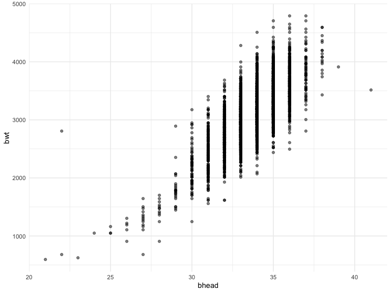
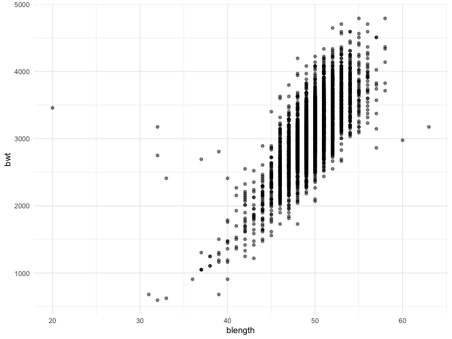
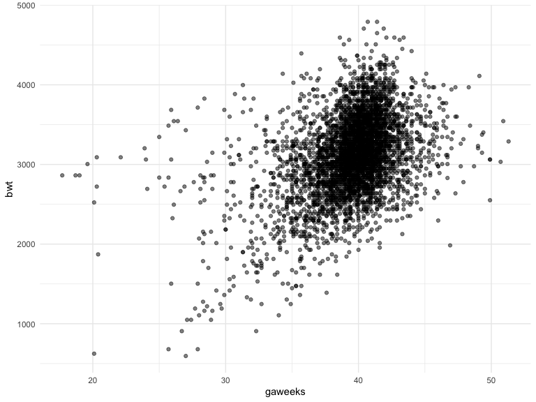
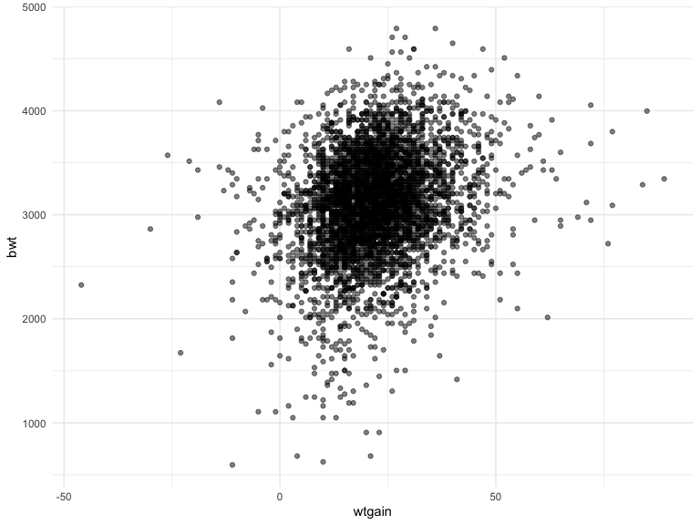
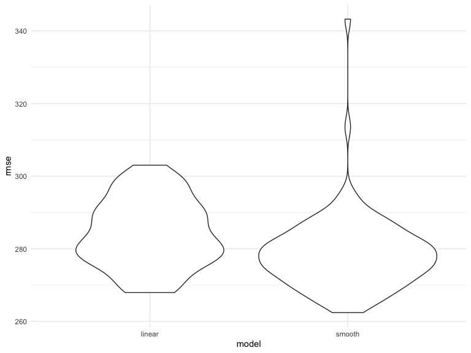
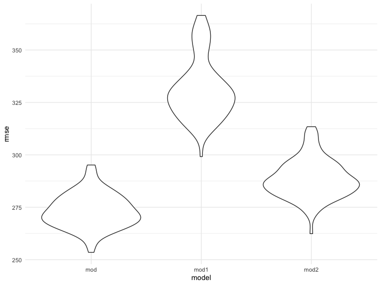
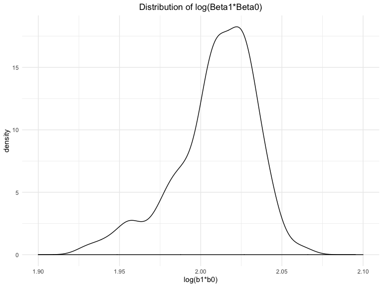

Homework 6
================
Rebecca Silva
11/15/2019

### Problem 1

``` r
# data read in 
birthweight = 
  read_csv("./data/birthweight.csv") %>% 
  mutate(babysex = factor(babysex, 
                          labels = c("male", "female")), 
         frace = factor(frace, 
                        labels = c("white", "black", "asian", "puerto rican", "other")),
         malform = factor(malform, 
                          labels = c("absent", "present")), 
         mrace = factor(mrace, 
                        labels = c("white", "black", "asian", "puerto rican")))
```

Since we are starting off with 20 variables, we elimate some based on
general hypothesis for variables that might not explain birthweight
well. We also elimate weight variables for which there exists a BMI
variables based on that category.

In order to predict birthweight, we want to understand how our given
variables relate to birthweight, and ultimately, include the most
important predictors of birthweight in our model.

We include some graphically dispictions of the relationships that seem
to have the strongest association.

``` r
# correalation matrix 
birthweight_numeric = 
  select_if(birthweight, is.numeric)
round(cor(birthweight_numeric %>% select(-bwt), birthweight %>% pull(bwt)), 2)
```

    ##           [,1]
    ## bhead     0.75
    ## blength   0.74
    ## delwt     0.29
    ## fincome   0.15
    ## gaweeks   0.41
    ## menarche -0.02
    ## mheight   0.19
    ## momage    0.14
    ## parity   -0.01
    ## pnumlbw     NA
    ## pnumsga     NA
    ## ppbmi     0.09
    ## ppwt      0.18
    ## smoken   -0.08
    ## wtgain    0.25

``` r
# baby’s head circumference at birth (centimeters)
birthweight %>% 
  ggplot(aes(x = bhead, y = bwt)) + 
  geom_point(alpha = .5)
```



``` r
# baby’s length at birth (centimeteres)
birthweight %>% 
  ggplot(aes(x = blength, y = bwt)) + 
  geom_point(alpha = .5)
```



``` r
birthweight %>% 
  ggplot(aes(x = gaweeks, y = bwt)) + 
  geom_point(alpha = .5)
```



``` r
# chose wtgain over delivery weight because thinking more relative 
birthweight %>% 
  ggplot(aes(x = wtgain, y = bwt)) + 
  geom_point(alpha = .5)
```



``` r
linear_mod = lm(bwt ~ bhead + blength +gaweeks + wtgain, data = birthweight)
smooth_mod = gam(bwt ~ s(bhead) + s(blength) + s(gaweeks) + s(wtgain), data = birthweight)
```

# check residuals

``` r
cv_df = 
  crossv_mc(birthweight, 100) 
cv_df =
  cv_df %>% 
  mutate(
    train = map(train, as_tibble),
    test = map(test, as_tibble))

birthweight_cv = 
  cv_df %>% 
  mutate(linear_mod  = map(train, ~lm(bwt ~ bhead + blength +gaweeks + wtgain, data = .x)),
         smooth_mod  = map(train, ~mgcv::gam(bwt ~ s(bhead) + s(blength) + s(gaweeks) + s(wtgain), data = .x))) %>% 
  mutate(rmse_linear = map2_dbl(linear_mod, test, ~rmse(model = .x, data = .y)),
         rmse_smooth = map2_dbl(smooth_mod, test, ~rmse(model = .x, data = .y)))
```

``` r
birthweight_cv %>% 
  select(starts_with("rmse")) %>% 
  pivot_longer(
    everything(),
    names_to = "model", 
    values_to = "rmse",
    names_prefix = "rmse_") %>% 
  mutate(model = fct_inorder(model)) %>% 
  ggplot(aes(x = model, y = rmse)) + geom_violin()
```



### Problem 2

``` r
weather_df = 
  rnoaa::meteo_pull_monitors(
    c("USW00094728"),
    var = c("PRCP", "TMIN", "TMAX"), 
    date_min = "2017-01-01",
    date_max = "2017-12-31") %>%
  mutate(
    name = recode(id, USW00094728 = "CentralPark_NY"),
    tmin = tmin / 10,
    tmax = tmax / 10) %>%
  select(name, id, everything())
```

``` r
get_terms = function(model){
  output1 = 
    model %>% 
    broom::glance() %>% 
    select(r.squared)
  
  output2 = 
    model %>% 
    broom::tidy() %>% 
    select(estimate)
  
  return(
    df = tibble(
      r_squared = as.numeric(output1), 
      log_b1b2 = log(output2$estimate[1]*output2$estimate[2])
    ))
}

weather_boot = 
  weather_df %>% 
  modelr::bootstrap(n = 100) %>% # change to 5000
  mutate(
    models = map(strap, ~lm(tmax ~ tmin, data = .x)),
    results = map(models, get_terms)) %>% 
  select(results) %>% 
  unnest(results) 
```

``` r
# plot distributions
weather_boot %>% 
  ggplot(aes( x = r_squared)) +
  geom_density() +
  xlim(c(.87, .95)) +
  labs(
    title = "Distribution of R-Squared", 
    x = "r-squared"
  ) +
  theme(plot.title = element_text(hjust = 0.5))
```



``` r
weather_boot %>% 
  ggplot(aes( x = log_b1b2)) +
  geom_density() +
  xlim(c(1.9, 2.1)) +
  labs(
    title = "Distribution of log(Beta1*Beta0)", 
    x = "log(b1*b0)"
  ) +
  theme(plot.title = element_text(hjust = 0.5))
```



# discribe distributions

identify the 2.5% and 97.5% quantiles to provide a 95% confidence
interval for r̂ 2 and log(β̂ 0∗β̂ 1)

``` r
quantile(weather_boot$r_squared, probs = c(0.025, 0.975)) %>% 
  knitr::kable(
    caption = "R-Squared 95% CI"
  )
```

|       |         x |
| ----- | --------: |
| 2.5%  | 0.8950387 |
| 97.5% | 0.9280213 |

R-Squared 95% CI

``` r
quantile(weather_boot$log_b1b2, probs = c(0.025, 0.975)) %>% 
  knitr::kable(
    caption = "Log(B1*B0) 95% CI"
  )
```

|       |        x |
| ----- | -------: |
| 2.5%  | 1.950625 |
| 97.5% | 2.043630 |

Log(B1\*B0) 95% CI

Our 95% confidence interval for r-squared is ()
